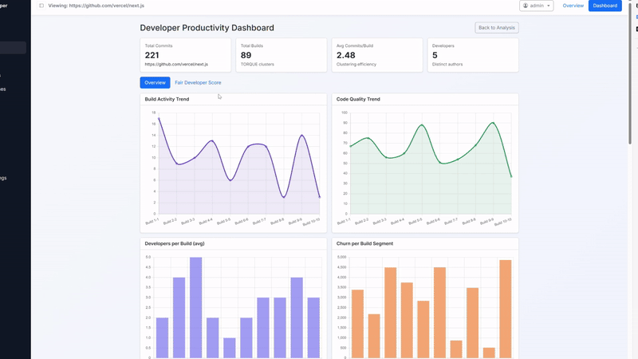
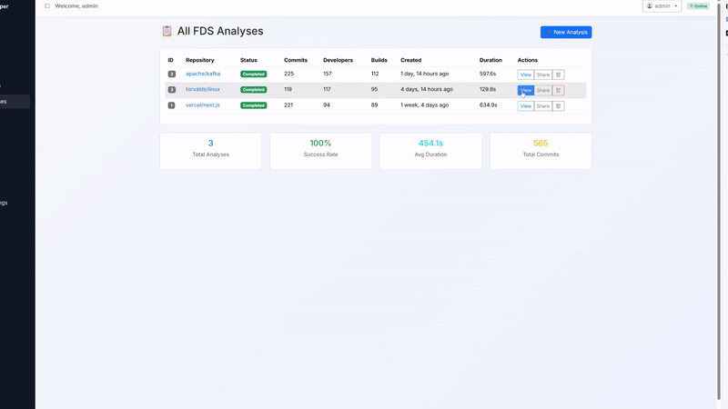

# Fair Developer Score (FDS) — An Explainable Productivity Metric for Git Repos

[](https://opensource.org/licenses/MIT)

> A principled, auditable alternative to "commit-count" metrics.
> FDS quantifies a developer's impact as **Effort × Build Importance**, using only repository data and robust statistics.

---

## 🚀 Why this project

Large organizations still lean on simplistic signals (commit counts, raw LOC). Those are easy to game and ignore context. FDS separates **how much a developer contributed** from **how much that work mattered** by first grouping commits into **builds** (logical working units) and then scoring each developer–build pair with transparent math.

---

## 💡 Core idea

We first **cluster commits into builds** (the smallest unit of value we measure), then score:

$\text{Contribution}(u, k) = \text{Effort}(u, k) \times \text{Importance}(k)$

$\text{FDS}(u) = \sum_k \text{Contribution}(u, k)$

Here `u` is a developer and `k` is a build. A tiny bug-fix build is not equivalent to a cross-module refactor build; the math reflects that.

---

## 🎥 Demo

### Web Application Interface



*Interactive dashboard showing developer contributions, build analysis, and real-time metrics*

### Analysis Results Visualization



*Detailed analysis results with charts, developer rankings, and build importance metrics*

---

## 📊 Data inputs (Git-only)

For each commit:

```
hash, author_name, author_email,
commit_ts_utc, insertions, deletions, files_changed,
dirs_touched (top-level), is_merge, msg_subject
```

Optional but useful:

```
file_paths                  # for "new-file" & key-path detection
dt_prev_author_sec          # recency for Speed
```

---

## ⚙️ Pre-processing

**Noise filtering → effective\_churn**
Down-weight or drop vendor/generated files, format-only sweeps, pure renames, mass moves.
`effective_churn = (insertions + deletions) × noise_factor`.

**Clustering commits into builds (torque-like)**
Per author, sort by time. Start a new **build** when:

```
Δt > TIME_GAP_HOURS  (default 2h)
OR
Jaccard(dir_set_curr, dir_set_prev) < JACCARD_MIN  (default 0.30)
```

**Directory co-change graph & PageRank**
Nodes = top-level directories; edge weight \$w\_{ij}\$ = co-change frequency.
Compute PageRank with damping \$\alpha = 0.85\$; store \$C(\text{dir})\$.

**Robust standardization (MAD-z)**
For every raw feature (except Share), per **repo × quarter**:

$z = \text{clip}\left(\frac{x - \text{median}}{1.4826 \cdot \text{MAD}}, -3, +3\right)$

---

## 💪 Effort — per developer `u` in build `k`

$$$\text{Effort}(u, k) = \text{Share}(u, k) \cdot \left(
0.25 \cdot Z_{\text{scale}}(u, k) + 0.15 \cdot Z_{\text{reach}}(u, k) + 0.20 \cdot Z_{\text{central}}(u, k) + 0.20 \cdot Z_{\text{dom}}(u, k) + 0.15 \cdot Z_{\text{novel}}(u, k) + 0.05 \cdot Z_{\text{speed}}(u, k)
\right)$$

### 🔧 Dimension settings (Effort)

* **📊 Share** — *Who owns the build?*
  ```
  Share(u, k) = author_effective_churn / build_effective_churn
  ```
  Range `[0,1]`. If denominator is 0, set Share=0.

* **📏 Scale** — *How big?*
  ```
  raw = log(1 + author_churn_in_build)
  ```
  Then MAD-z. `author_churn_in_build = Σ(insertions + deletions) (after noise)`

* **🌐 Reach** — *How wide?* (directory entropy)
  ```
  p_i = churn_in_dir_i / total_author_churn
  ```
  
  $$H = -\sum_i p_i \log_2 p_i$$
  
  (0 if one directory). Then MAD-z.

* **🎯 Centrality** — *How core?*
  ```
  raw = mean(C(dir))
  ```
  over dirs the author touched in the build (recommended: churn-weighted mean). Then MAD-z.

* **👑 Dominance** — *Who leads?*
  
  ```
  raw = 0.3 × is_first + 0.3 × is_last + 0.4 × commit_count_share
  ```
  
  Cap to [0,1]. Then MAD-z.

* **✨ Novelty** — *How new?*
  
  $$\text{raw} = \frac{\text{new file lines} + \text{key path lines}}{\text{author churn}}$$
  
  Cap to ≤ 2.0. Then MAD-z.
  *(key_path_lines = lines in files under "hot" dirs or high-centrality nodes)*

* **⚡ Speed** — *How fast?* *(optional if recency available)*
  
  $$\text{raw} = \exp\left(-\frac{\text{hours since prev author commit}}{\tau_{\text{speed h}}}\right)$$
  
  Default τ_speed_h = 24; then MAD-z.

---

## ⭐ Build Importance — per build `k`

$$\text{Importance}(k) = 0.30 \cdot Z_{\text{scale}}(k) + 0.20 \cdot Z_{\text{scope}}(k) + 0.15 \cdot Z_{\text{central}}(k) + 0.15 \cdot Z_{\text{complex}}(k) + 0.10 \cdot Z_{\text{type}}(k) + 0.10 \cdot Z_{\text{release}}(k)$$

### 🎯 Dimension settings (Importance)

* **📏 Scale** — *How large?*
  
  $$\text{raw} = \log(1 + \text{total churn}_k)$$
  
  where total_churn_k = Σ effective_churn (all authors); MAD-z.

* **🌍 Scope** — *How broad?*
  
  $$\text{raw} = 0.5 \cdot \text{files changed} + 0.3 \cdot H_{\text{dir}} + 0.2 \cdot \text{unique dirs}$$
  
  Then MAD-z. H_dir is directory entropy computed over the entire build's churn distribution.

* **🎯 Centrality** — *How core?*
  ```
  raw = mean(C(dir))
  ```
  over **all** dirs touched in the build (unweighted or churn-weighted); MAD-z.

* **🧩 Complexity** — *How hard?*
  
  $$\text{raw} = \sqrt{\text{unique dirs} \times \log(1 + \text{total churn}_k)}$$
  
  MAD-z. (Square-root tempers growth while keeping multi-module × large edits higher.)

* **🚨 Type Priority** — *How urgent?*
  Lightweight message classifier → coefficient; then MAD-z.
  Default mapping:

  ```
  🔒 security 1.20  🚑 hotfix 1.15  ✨ feature 1.10  ⚡ perf 1.05
  🐛 bugfix 1.00    🔧 refactor 0.90  📝 doc 0.60     ❓ other 0.80
  ```

* **🎯 Release Proximity** — *How late?*
  
  $$\text{raw} = \exp\left(-\frac{\text{days to nearest tag or merge}}{\tau_{\text{release d}}}\right)$$
  
  Default τ_release_d = 30; MAD-z.
  (Distance to nearest annotated tag or merge-to-main used as a release proxy.)

---

## 🏆 Final scoring

```
Contribution_{u,k} = Effort_{u,k} × Importance_k
```

```
FDS(u) = Σ_k Contribution_{u,k}    (over chosen window, e.g., quarter)
```

Effort captures **who lifted how much**; Importance captures **how heavy the build actually is**. Using the same yardsticks (scale, centrality) at two levels prevents "free rides" on critical builds and "thankless marathons" on peripheral ones.

---

## 📈 Output artifacts

| File | Description | Content |
|------|-------------|---------|
| 🏗️ `build_table.csv` | **Build Analysis** | Per build: each Importance component (raw & z) and final `importance` |
| 💪 `effort_table.csv` | **Developer Effort** | Per developer–build: Share, each Effort component (raw & z), and final `effort` |
| 🤝 `contribution_table.csv` | **Contributions** | Per developer–build: `contribution = effort × importance` |
| 🏆 `fds_table.csv` | **Final Scores** | Per developer: aggregated FDS over the configured time window |

---

## 🔧 Configuration knobs (defaults)

```text
# Clustering
TIME_GAP_HOURS = 2
JACCARD_MIN    = 0.30

# Centrality
ALPHA_PAGERANK = 0.85

# Decays
TAU_SPEED_H    = 24     # hours
TAU_RELEASE_D  = 30     # days

# Robust stats
MAD_CLIP_LOW   = -3
MAD_CLIP_HIGH  =  3
STATS_WINDOW   = "repo×quarter"

# Effort weights
W_SCALE   = 0.25
W_REACH   = 0.15
W_CENTRAL = 0.20
W_DOM     = 0.20
W_NOVEL   = 0.15
W_SPEED   = 0.05

# Importance weights
A_SCALE   = 0.30
A_SCOPE   = 0.20
A_CENTRAL = 0.15
A_COMPLEX = 0.15
A_TYPE    = 0.10
A_RELEASE = 0.10
```

All thresholds/weights are configurable (YAML/JSON/env). Teams can tune them against internal ground truth (e.g., release notes, hot-fix lists).

---

## 📄 License & contributions

This project is licensed under the MIT License. See the [LICENSE](LICENSE) file for details.

Contributions are welcome—new message classifiers, better noise rules, UI integrations, and additional evaluation datasets.

---

<div align="center">

**⭐ Star this repo if FDS helps you build fairer developer evaluation systems! ⭐**

Made with ❤️ for transparent and equitable software development

</div>
